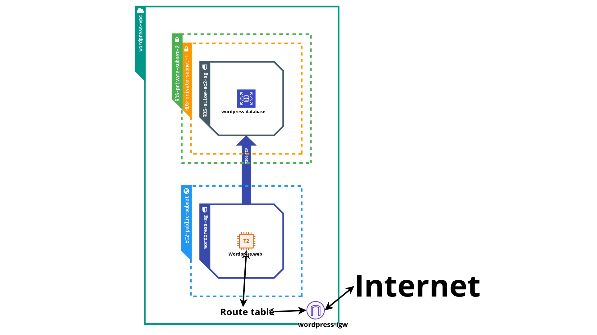

# Terraform WordPress Deployment on AWS

This Terraform project allows you to deploy a WordPress website on AWS using EC2, RDS, and S3. It sets up an Ubuntu EC2 instance, an RDS MySQL database, and an S3 bucket for media files storage. The Terraform state file will be managed from an S3 bucket, and the Terraform state locking is set up with DynamoDB.

## Prerequisites

Before you start, make sure you have the following prerequisites:

1.  Terraform installed on your machine.
2.  AWS CLI installed and configured with your AWS access key and secret access key.

    - [Help](https://www.youtube.com/watch?v=a03_FJl2Xt8) to create an Access key

          aws config

    - Enter the keys and region

## Additional Notes

- The project uses an Ubuntu EC2 instance.
- The EC2 instance is launched with an SSH key.
- The userdata_ubuntu.tpl script installs WordPress and configures it with the provided database and S3 settings.
- The S3 bucket is created to store media files for WordPress.

## Initial AWS Resource Setup

### Create an S3 bucket to manage the Terraform state file:

- Go to the AWS Management Console.
- Navigate to the S3 service.
- Click on "Create bucket."
- Enter a unique name for your bucket.
- Choose a region for the bucket (e.g., "eu-west-1" for Ireland).
- Set Bucket Versioning to "Enable"
- Leave the rest of the settings as default and click "Create bucket."

### Create a DynamoDB table to manage the Terraform state locking service:

- Go to the AWS Management Console.
- Navigate to the DynamoDB service.
- Click on "Create table."
- Enter a unique table name (e.g., "TerraformLocks").
- Use "LockID" as the Partition key and choose the data type "String."
- Click on "Create" to create the table.

## Configuration

1. Fork this repository.
### GitHub Secrets Setup

Before running the workflow, ensure you have set up the necessary secrets in the forked GitHub repository. These secrets will be used to configure the AWS CLI and database credentials for the Terraform apply step in the GitHub Actions workflow:

1. Navigate to the forked repository.
2. Click on "Settings".
3. In the left sidebar, click on "Secrets and variables" -> "Actions".
4. Click on "New repository secret" and add the following secrets:

   - `AWS_ACCESS_KEY_ID`: Your AWS access key ID.
   - `AWS_REGION`: The region of your account (us-east-1 or eu-west-3 or etc.).
   - `AWS_SECRET_ACCESS_KEY`: Your AWS secret access key.
   - `DATABASE_NAME`: The name of the MySQL database for WordPress (what you want).
   - `DATABASE_PASSWORD`: The password for the MySQL database (must be at least 8 characters).
   - `DATABASE_USER`: The username for the MySQL database (what you want).

   Note: Ensure that these secrets are kept safe and never shared publicly.

### Terraform Configuration

1. Clone the forked Repository.

2. In the "main.tf" update the bucket, region, and dynamodb_table fields with the names you've created the S3 bucket and DynamoDB table to handle backend services:

   ```t
      terraform {
         backend "s3" {
            bucket         = "your-bucket-name"
            key            = "terraform.tfstate"
            region         = "your-region"
            dynamodb_table = "your-dynamodb_table-name"
         }
      }
   ```

3. Update the variables.tf file with your desired settings (region, instance type, key name, etc.).
4. Run this command to initialize a working directory containing Terraform configuration files:

   terraform init

5. Commit your changes.
6. Push your commit.

## Accessing WordPress

1. Go back to the repository on Github and click on the "Actions".
2. On the left select the "Terraform WordPress" workflow.
3. Click on the commit which triggered the workflow.
4. If the workflow succeded open down the "Terraform apply" step.
5. At the end of this step look after a line which starts with "INFO", you will find the URL of the Wordpress instance.
6. Open it and set up your WordPress account. :)   

## Cleanup

1. Destroy the infrastructure:
   - In the temrinal navigate to the repository directory and run this command with the values of the secrets which you set up in the GitHub repository:
   ```t
      terraform destroy \
         -var 'aws_access_key_id=your_aws_access_key_id' \
         -var 'aws_secret_access_key=your_aws_secret_access_key' \
         -var 'database_name=your_db_name' \
         -var 'database_password=your_db_password' \
         -var 'database_user=your_db_user'
   ```

## View of the Infrastructure

1. View of the infrastructure: 


## Reminder

This project deals with sensitive information, such as AWS access keys and database credentials. Avoid sharing these with unauthorized parties. Always follow best security practices when working with cloud resources.
